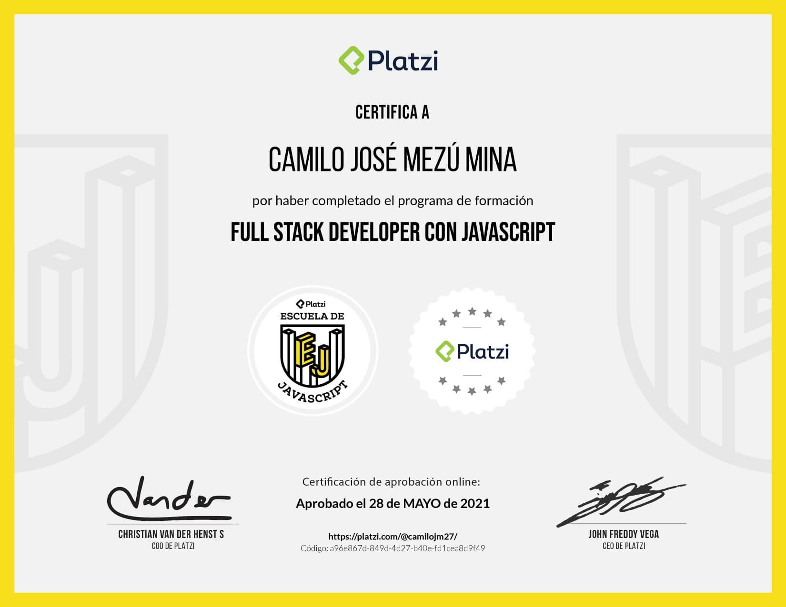

# Escuela de JavaScript - Platzi
### Duración: 6 meses (2022)
Durante mi participación en la Escuela de JavaScript de Platzi, he adquirido una sólida formación en el desarrollo web
utilizando el lenguaje JavaScript. Esta experiencia me ha permitido explorar y dominar diversos aspectos de la
programación web y me ha brindado una base sólida en el desarrollo front-end y back-end,
trabajando con tecnologías como React, NestJS, Nextjs, React Native, y Node.js.
Además, obtuve habilidades en la gestión de dependencias, integración de APIs, y construcción de proyectos.

## Proyecto:
Como proyecto de la escuela de js 